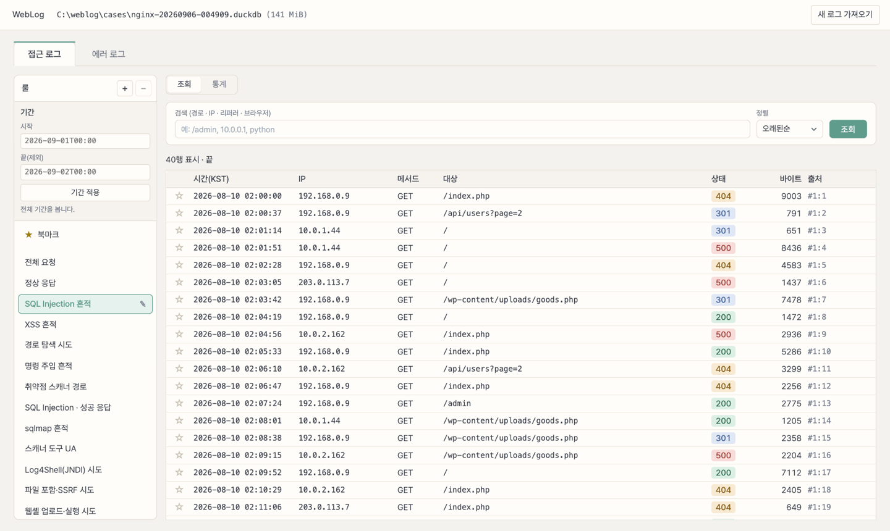
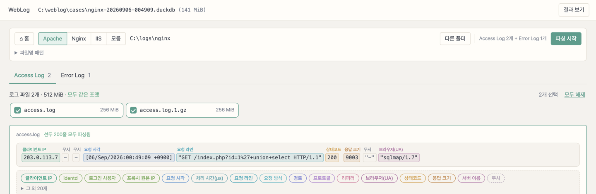

<h1 align="center">WebLog</h1>

<p align="center">
  형식을 가리지 않는 웹 서버 로그 분석기.<br />
  포맷을 화면에서 정의하고, YARA 문법의 룰로 걸러 본다.
</p>

<p align="center">
  <a href="https://github.com/tkddnr924/WebLog-analysis/releases"></a>
  
  
  
</p>

<p align="center">
  
</p>

---

## 형식을 가리지 않는다

폴더를 지정하면 접근 로그와 에러 로그를 함께 찾아, 파일마다 선두 200줄로 포맷을 판별하고 같은 포맷끼리 묶는다.

| 자동 판별 | 비고 |
|---|---|
| Apache / Nginx `common`, `combined` | 필드 순서가 바뀌어도 판별한다 |
| IIS W3C | `#Fields` 헤더를 읽는다 |
| Nginx / Apache error_log | `client`·`server`·`request`·`upstream`을 따로 저장 |
| `.gz` | 풀지 않고 그대로 읽는다 |

판별되지 않는 형식은 **화면에서 정의한다.** 첫 줄을 조각으로 나눠 색으로 칠하고 조각마다 뜻을 붙여 보여준다. 틀린 조각에 아래 라벨을 끌어다 놓으면 즉시 다시 파싱해 "선두 200줄 모두 파싱됨 / 오류 N"으로 답한다. 정규식을 쓰지 않고, 구분자가 공백·파이프·쉼표·탭 어느 쪽이든 맞출 수 있다. 완성한 정의는 프리셋으로 저장돼 다음 사건에 재사용된다.

<p align="center">
  
</p>

## YARA 문법으로 거른다

찾을 조건은 룰로 쓴다. 룰 하나를 고르면 조회와 통계가 같은 조건으로 돈다.

```yara
rule sql_injection_success {
  meta:
    name = "SQL Injection · 성공 응답"
    description = "서명이 있는데 2xx로 응답한 요청"
  strings:
    $union = /union[\s+]+select/ nocase
    $quote = "%27"
  condition:
    status in 200..299 and any of them
}
```

| | |
|---|---|
| 접근 로그 필드 | `status` `bytes` `method` `ip` `path` `protocol` `referrer` `ua` |
| 에러 로그 필드 | `level` `message` `ip` |
| 연산 | `== != > >= < <=` · `in 400..499` · `contains` `icontains` `startswith` `endswith` `matches` · `is null` |
| 조합 | `and` `or` `not` · `any of them` · `all of ($a*)` |

내장 룰 27개로 바로 시작한다. 접근 로그는 SQL Injection, XSS, 경로 탐색, 명령 주입, 스캐너 경로, sqlmap, 스캐너 UA, Log4Shell, 파일 포함·SSRF, 웹셸 업로드·실행, 봇 UA 등 15개. 에러 로그는 심각·오류·경고, 파일 없음, 권한 거부, 업스트림 연결 실패, 요청 본문 초과, SSL 핸드쉐이크 오류, PHP·FastCGI 실패 등 12개. 원문을 열어 고치면 자기 룰이 되고, 편집기가 문법 오류 위치를 실시간으로 짚는다.

사이드바 맨 위의 **기간**은 룰보다 상위 조건이다. 사고 시각을 넣으면 조회·통계, 접근·에러 어느 화면으로 옮겨도 그 구간만 본다.

## 결과를 다루는 방법

|  |  |
|---|---|
| **조회** | 수백만 행을 스크롤로 훑는다. 경로·IP·리퍼러·UA 통합 검색, 행을 고르면 구조화 필드와 재구성한 로그 한 줄 |
| **통계** | 시간별 요청 수, 상태코드·메서드 분포, 상위 IP(최초·마지막 탐지)·요청 대상. 에러는 레벨 분포와 상위 메시지 |
| **북마크** | 접근·에러를 가리지 않고 한 목록에 모인다 |
| **내보내기** | 지금 조건 그대로 CSV·JSON Lines. 취소해도 그때까지의 결과가 남는다 |
| **중단 복구** | 파싱이 끊겨도 마지막 확정 지점부터 이어간다 |

## 시작하기

1. [Releases](https://github.com/tkddnr924/WebLog-analysis/releases)에서 `Weblog-analysis.exe`를 받는다.
2. 쓰기 가능한 폴더에 두고 실행한다. 설치도 관리자 권한도 필요 없다.
3. 서버 종류를 고르고 로그 폴더를 지정한 뒤 **파싱 시작**을 누른다.

Windows 10 20H2 이상 / Windows 11 x64. 화면 표시에 쓰는 Edge WebView2 런타임은 해당 버전에 기본 포함되어 있고, Visual C++ 재배포 패키지는 필요 없다.

결과는 실행 파일 옆 `cases` 폴더에만 쌓인다. 사건 하나가 `.duckdb` 파일 하나이며, 원본 로그 문장은 저장하지 않고 파싱된 필드와 출처(파일·줄 번호)만 남긴다.

---

설계 결정과 데이터 명세는 [프로젝트 위키](docs/README.md), 측정치는 [벤치마크](docs/benchmarks.md), 검증 현황은 [검증 기록](docs/verification.md)에 있다.
